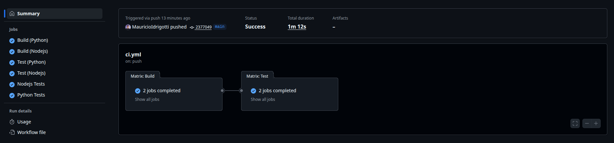
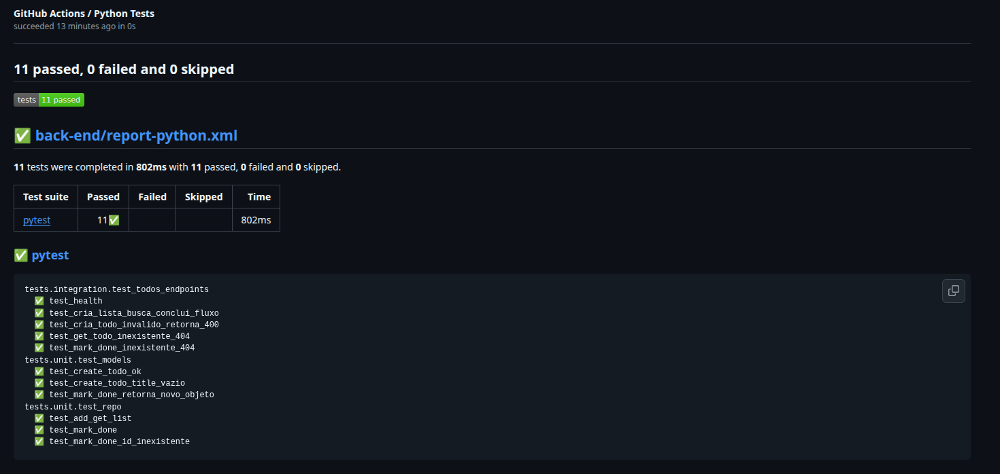

# 🚀 Multi-Language CI/CD Pipeline

[](https://github.com/DevOpsProjectsLab/multilang-pipeline/actions/runs/18698906640/job/53323257083)


**Multi-Language CI/CD Pipeline** é um projeto desenvolvido no âmbito da organização **[DevOpsProjectsLab](https://github.com/DevOpsProjectsLab)**, com foco em demonstrar práticas modernas de **Integração Contínua (CI)** aplicadas a ambientes **multi-stack**.

Este repositório exemplifica como estruturar um **pipeline unificado e escalável** para aplicações compostas por múltiplas linguagens — neste caso, **Python (Back-End)** e **Node.js (Front-End)**.

O pipeline, definido em [`ci.yml`](.github/workflows/ci.yml), utiliza o recurso de **matrix strategy** do GitHub Actions para executar **pipelines paralelas e independentes** de build e testes, otimizando performance, isolamento e rastreabilidade dos resultados.

---

## 🧰 Tecnologias Utilizadas

- **GitHub Actions** — Integração Contínua (CI)
- **Python 3.12** — API de Back-End
- **Node.js 20** — Aplicação Front-End
- **Pytest** — Testes unitários e de integração (Python)
- **Vitest + React Testing Library** — Testes do Front-End
- **dorny/test-reporter** — Relatórios unificados de testes no GitHub

---

## 🏗️ Estrutura do Projeto

```bash
multilang-pipeline/
├── .github/
│   ├── workflows/
│   │   └── ci.yml          # Pipeline CI/CD
│   └── assets/             # Imagens usadas no README
│
├── back-end/
│   ├── app/
│   │   ├── main.py         # Ponto de entrada da API
│   │   ├── models.py       # Modelos de dados
│   │   ├── repo.py         # Camada de repositório
│   │   └── schemas.py      # Schemas Pydantic
│   ├── tests/
│   │   ├── unit/           # Testes unitários
│   │   └── integration/    # Testes de integração
│   ├── requirements.txt    # Dependências do Python
│   └── pytest.ini          # Configurações do Pytest
│
├── front-end/
│   ├── src/
│   │   ├── components/     # Componentes React
│   │   ├── App.jsx         # Componente principal
│   │   ├── main.jsx        # Ponto de entrada da aplicação
│   │   └── setupTests.js   # Configuração global de testes (importa '@testing-library/jest-dom')
│   ├── tests/
│   │   ├── unit/           # Testes unitários
│   │   └── integration/    # Testes de integração
│   ├── vite.config.js      # Configuração do Vite
│   ├── vitest.config.js     # Configuração do Vitest (test runner)
│   ├── package.json        # Dependências Node
│   ├── package-lock.json    # Lockfile para builds reprodutíveis
│   └── scripts/
│       └── convert-vitest-junit.js  # Conversor de relatório para JUnit XML
│
├── README.md
└── .gitignore
```

---

## 🧠 Sobre o Workflow `ci.yml`

O arquivo [`ci.yml`](.github/workflows/ci.yml) é o **núcleo do projeto**, responsável por orquestrar o processo de integração contínua de forma automatizada.  
Ele utiliza a **matrix strategy** para criar **duas execuções paralelas**, uma para cada linguagem:

- 🐍 **Python:** build, testes unitários e de integração com `pytest`;
- 🟩 **Node.js:** build, testes unitários e integrados com `Vitest`.

Essa estrutura permite que cada ambiente seja tratado de forma isolada, garantindo independência, paralelismo e clareza no monitoramento dos resultados.


## ⚙️ Pipeline CI/CD

O workflow [`ci.yml`](.github/workflows/ci.yml) realiza **builds e testes paralelos** para múltiplas linguagens:

### 🧩 Jobs

| Job | Linguagem | Descrição |
|-----|------------|-----------|
| `Build (Python)` | 🐍 Python | Instala dependências e compila código |
| `Build (Nodejs)` | 🟩 Node.js | Instala dependências e gera build do front |
| `Test (Python)` | 🧪 Pytest | Executa testes unitários e de integração |
| `Test (Nodejs)` | ⚡ Vitest | Executa testes unitários e integrados |
| `Test Report` | 📊 CI/CD | Publica resultados de testes no GitHub |

---

### 📸 Visão Geral do Pipeline



---

### 📊 Relatórios de Testes

Cada linguagem possui seu próprio **painel de resultados** dentro do GitHub Actions.  
Através da **matrix strategy**, os testes de **Python** e **Node.js** são executados em paralelo, garantindo isolamento e independência entre os ambientes.

Os relatórios são publicados automaticamente por meio da Action [**dorny/test-reporter**](https://github.com/dorny/test-reporter), que gera **painéis separados** — um para cada job — exibindo métricas detalhadas de execução e status dos testes.

Essa abordagem permite monitorar, de forma precisa e individual, a qualidade de cada stack dentro do pipeline CI/CD.



> 📊 Acesse uma execução real desta pipeline em [**GitHub Actions**](https://github.com/DevOpsProjectsLab/multilang-pipeline/actions) para visualizar os relatórios publicados automaticamente.

---

## 💻 Executando Localmente

### 🐍 Back-End (Python)

```bash
cd back-end
python -m venv .venv
source .venv/bin/activate  # Linux/macOS
# ou .venv\Scripts\activate  # Windows

pip install -r requirements.txt
pytest --junitxml=report-python.xml
```

### 🟩 Front-End (Node.js)

```bash
cd front-end
npm ci
npm run build
npm run test:ci
```

---

## 📂 Estrutura de Testes

Os testes foram divididos por **nível** e **linguagem**, garantindo modularidade:

| Localização | Tipo de Teste | Linguagem |
|--------------|----------------|------------|
| `back-end/tests/unit/` | Unitário | Python |
| `back-end/tests/integration/` | Integração | Python |
| `front-end/tests/unit/` | Unitário | Node.js |
| `front-end/tests/integration/` | Integração | Node.js |

---

## 🧩 Resultados Técnicos

Este projeto demonstra na prática:

- Implementação de **CI multi-linguagem** com GitHub Actions  
- Execução **paralela** de pipelines isoladas via *matrix strategy*  
- **Automação completa de build e testes** para Python e Node.js  
- Geração de **relatórios automatizados** por job com `dorny/test-reporter`  
- Estrutura de **monorepo organizada e extensível**  
- Integração contínua entre múltiplas stacks dentro de um único fluxo CI
